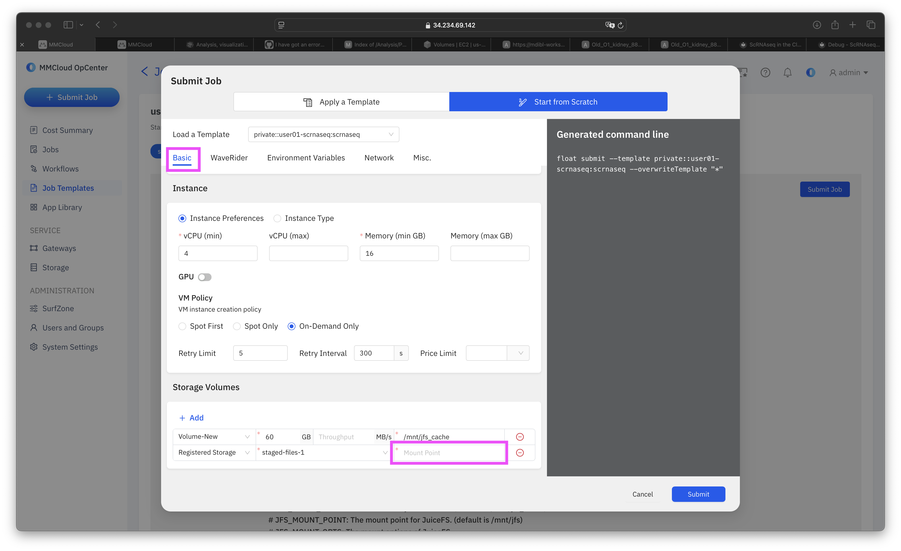
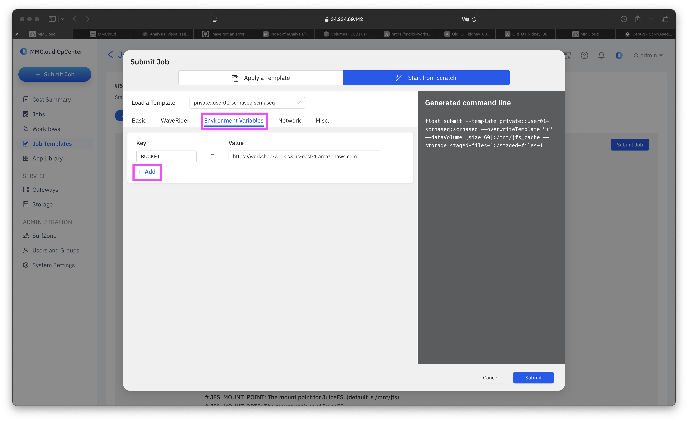

# Debug
## Surprise Adventure

The Error we are seeing: 

```
2024-10-23T22:49:55.488: Failed to create float image volume: 
VolumeLimitExceeded: You have exceeded your maximum gp2 storage limit of 86 TiB in this region. 
Please contact AWS Support to request an Elastic Block Store service limit increase.
```

## Solution

### **Step 0**: We increased our AWS limit for gp2 maximum storage 86 TiB to 200 TiB.

### **Step 1**: Go back to your template


### **Step 2**: Select **Submit Job**

### **Step 3**: Select **Start from Scratch**

### **Step 4**: Set **Mount Point**

A. On the *Basic* Page, scroll to the Storage Volumes section at the bottom: 



B. In the Mount Point Field paste the following Mount location:
```
/staged-files-1
```
This page should now look like this: 


### **Step 5**: Point to **Previous Job**

A. Navigate to the *Environment Variables* Page: 



B. Select **+ Add**

C. In the **Key** Field, add the following: 
```
PREVIOUS_JOB_ID
```

D. In the **Value** Field, add the ID that corresponds to your username: 

!!! danger "User Specific Job IDs"

    === "User 01"

        **curious-bernard**

        ```
        mdg5kjqo5yqahen5qxin5
        ```

    === "User 02"

        **tiny-lavoisier**

        ```
        qy9auxnhm6fo0tudjtbir
        ```

    === "User 03"

        **exotic-keller**

        ```
        f6wyb1lo6re2smb6m9j6k
        ```

    === "User 04"

        **fabulous-coulomb**

        ```
        w5edz97wi9osuhl1udc4c
        ```

    === "User 05"

        **magical-goldberg**

        ```
        xht1csr275vziulx7odky
        ```

    === "User 06"

        ** lethal-ride**

        ```
        qkl6elbmncy41bdpq3420
        ```

    === "User 07"

        **spontaneous-carson**

        ```
        k3zex0agw64gu9jp02giu
        ```

    === "User 08"

        **ecstatic-tesla**

        ```
        vhkzda3nbw6rzg5glijwi
        ```

    === "User 09"

        **Aissette!!! You are the lucky winner!!! You job completed successfully. You did however choose template 20 instead of template 09, meaning that your output will be in bucket `workshop-user20`.**

    === "User 10"

        **backstabbing-pesquet**

        ```
        cl3ckl8kunbq7lwctuyuu
        ```

It should end up looking like this (except with your own ID):


### **Step 6**: **Submit!**
