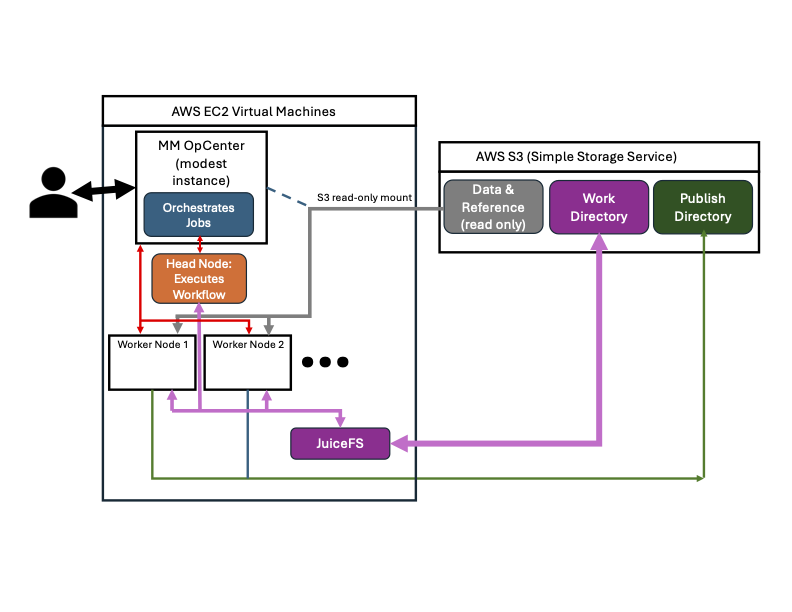

# Launch Setup


## **Pre-Built Template** vs **MMCloud Air** vs **Float CLI**

!!! Note "Methods"

    === "Pre-Built Template"

        For this course, we have already set up the full configuration for the pipleines. To submit, go to the [MMCloud Opcenter](https://34.234.69.142/#/login) and and launch your designated pipeline.

    === "MMCloud Air"

        Launching in [MMCloud Air](https://air.mmcloud.io/) is fully web-based allowing users to launch the pipeline from the web in a GUI. 
    
    === "Float CLI"

        Launching from the Float CLI gives you the most control. You have full control of the launch, but need to be familiar with the float cli.

## **Workflow Architecture**




## **`nf-core/scrnaseq` Setup**

[:fontawesome-brands-square-github: GitHub](https://github.com/nf-core/scrnaseq/tree/2.7.1){.md-button .md-button--primary}

!!! example "Launch Methods"

    === "Pre-Built Template"

        1. Sign in to the [MMCloud Opcenter](https://34.234.69.142/#/login) with your given credentials.
        2. Select **Job Templates** from the left hand panel.
        3. Select **Private**.
        4. Select the Template for `scrnaseq` that matches your user name.
        5. **Submit!** 


    === "MMCloud Air"

        ### **Step 1: Name and Job Resources**

        **Nextflow generic workflow**

        Job Name

        ```
        user<number>-scrnaseq-run
        ``` 

        MMCloud OpCenter

        ```
        mdibl-workshop-opcenter
        ```

        Storage
        
        ```
        mdibl-workshop
        ```

        Security Group
        ```
        tbd
        ```

        ### **Step 2: Parameters**

        Nextflow run command cli

        ```
        nextflow run nf-core/scrnaseq -r 2.7.0
        ```

        VM instance policy for worker nodes
        !!! note
            `spotOnly` can be set for maximum savings 
        ```
        [spotFirst=true,retryLimit=5,retryInterval=300s]
        ```

        Staged Mount
        ```
        https://mdibl-workshop.s3.us-east-1.amazonaws.com
        ```

        Output Bucket
        ```
        s3://workshop-user<number>/scranseq-output/
        ```

        Input sample `.csv` file

        !!! note 
            Young_Y1_lung_29w sample has been removed. The authors found batch effects in this sample and excluded it in downstream analysis. Might be good to keep in as a teaching tool, but their method of batch detection would need to be incorporated into our workflow, so we're leaving it out.

        ```
        sample,fastq_1,fastq_2
        Young_Y1_kidney_29w,/staged-files-1/data/SRR9320581/Y1K1_R1_001.fastq.gz,/staged-files-1/data/SRR9320581/Y1K1_R2_001.fastq.gz
        Young_Y1_kidney_29w,/staged-files-1/data/SRR9320582/Y1K2_R1_001.fastq.gz,/staged-files-1/data/SRR9320582/Y1K2_R2_001.fastq.gz
        Young_Y1_spleen_29w,/staged-files-1/data/SRR9320585/Y1S1_R1_001.fastq.gz,/staged-files-1/data/SRR9320585/Y1S1_R2_001.fastq.gz
        Young_Y3_kidney_31w,/staged-files-1/data/SRR9320586/Y3K1_R1_001.fastq.gz,/staged-files-1/data/SRR9320586/Y3K1_R2_001.fastq.gz
        Young_Y3_kidney_31w,/staged-files-1/data/SRR9320587/Y3K2_R1_001.fastq.gz,/staged-files-1/data/SRR9320587/Y3K2_R2_001.fastq.gz
        Young_Y3_lung_31w,/staged-files-1/data/SRR9320588/Y3RL1_R1_001.fastq.gz,/staged-files-1/data/SRR9320588/Y3RL1_R2_001.fastq.gz
        Young_Y3_lung_31w,/staged-files-1/data/SRR9320589/Y3RL2_R1_001.fastq.gz,/staged-files-1/data/SRR9320589/Y3RL2_R2_001.fastq.gz
        Young_Y3_spleen_31w,/staged-files-1/data/SRR9320590/Y3S1_R1_001.fastq.gz,/staged-files-1/data/SRR9320590/Y3S1_R2_001.fastq.gz
        Young_Y3_spleen_31w,/staged-files-1/data/SRR9320591/Y3S2_R1_001.fastq.gz,/staged-files-1/data/SRR9320591/Y3S2_R2_001.fastq.gz
        Young_Y4_kidney_34w,/staged-files-1/data/SRR9320592/Y4K1_R1_001.fastq.gz,/staged-files-1/data/SRR9320592/Y4K1_R2_001.fastq.gz
        Young_Y4_kidney_34w,/staged-files-1/data/SRR9320593/Y4K2_R1_001.fastq.gz,/staged-files-1/data/SRR9320593/Y4K2_R2_001.fastq.gz
        Young_Y4_lung_34w,/staged-files-1/data/SRR9320594/Y4RL1_R1_001.fastq.gz,/staged-files-1/data/SRR9320594/Y4RL1_R2_001.fastq.gz
        Young_Y4_lung_34w,/staged-files-1/data/SRR9320595/Y4RL2_R1_001.fastq.gz,/staged-files-1/data/SRR9320595/Y4RL2_R2_001.fastq.gz
        Young_Y4_spleen_34w,/staged-files-1/data/SRR9320596/Y4S1_R1_001.fastq.gz,/staged-files-1/data/SRR9320596/Y4S1_R2_001.fastq.gz
        Young_Y4_spleen_34w,/staged-files-1/data/SRR9320597/Y4S2_R1_001.fastq.gz,/staged-files-1/data/SRR9320597/Y4S2_R2_001.fastq.gz
        Young_Y5_kidney_34w,/staged-files-1/data/SRR9320598/Y5K1_R1_001.fastq.gz,/staged-files-1/data/SRR9320598/Y5K1_R2_001.fastq.gz
        Young_Y5_kidney_34w,/staged-files-1/data/SRR9320599/Y5K2_R1_001.fastq.gz,/staged-files-1/data/SRR9320599/Y5K2_R2_001.fastq.gz
        Young_Y5_lung_34w,/staged-files-1/data/SRR9320600/Y5RL1_R1_001.fastq.gz,/staged-files-1/data/SRR9320600/Y5RL1_R2_001.fastq.gz
        Young_Y5_lung_34w,/staged-files-1/data/SRR9320601/Y5RL2_R1_001.fastq.gz,/staged-files-1/data/SRR9320601/Y5RL2_R2_001.fastq.gz
        Young_Y5_spleen_34w,/staged-files-1/data/SRR9320602/Y5S1_R1_001.fastq.gz,/staged-files-1/data/SRR9320602/Y5S1_R2_001.fastq.gz
        Young_Y5_spleen_34w,/staged-files-1/data/SRR9320603/Y5S2_R1_001.fastq.gz,/staged-files-1/data/SRR9320603/Y5S2_R2_001.fastq.gz
        Old_O1_kidney_88w,/staged-files-1/data/SRR9320604/O1K1_R1_001.fastq.gz,/staged-files-1/data/SRR9320604/O1K1_R2_001.fastq.gz
        Old_O1_kidney_88w,/staged-files-1/data/SRR9320605/O1K2_R1_001.fastq.gz,/staged-files-1/data/SRR9320605/O1K2_R2_001.fastq.gz
        Old_O1_lung_88w,/staged-files-1/data/SRR9320606/O1RL1_R1_001.fastq.gz,/staged-files-1/data/SRR9320606/O1RL1_R2_001.fastq.gz
        Old_O1_lung_88w,/staged-files-1/data/SRR9320607/O1RL2_R1_001.fastq.gz,/staged-files-1/data/SRR9320607/O1RL2_R2_001.fastq.gz
        Old_O1_spleen_88w,/staged-files-1/data/SRR9320608/O1S1_R1_001.fastq.gz,/staged-files-1/data/SRR9320608/O1S1_R2_001.fastq.gz
        Old_O1_spleen_88w,/staged-files-1/data/SRR9320609/O1S2_R1_001.fastq.gz,/staged-files-1/data/SRR9320609/O1S2_R2_001.fastq.gz
        Old_O2_kidney_91w,/staged-files-1/data/SRR9320610/O2K1_R1_001.fastq.gz,/staged-files-1/data/SRR9320610/O2K1_R2_001.fastq.gz
        Old_O2_kidney_91w,/staged-files-1/data/SRR9320611/O2K2_R1_001.fastq.gz,/staged-files-1/data/SRR9320611/O2K2_R2_001.fastq.gz
        Old_O2_lung_91w,/staged-files-1/data/SRR9320612/O2RL1_R1_001.fastq.gz,/staged-files-1/data/SRR9320612/O2RL1_R2_001.fastq.gz
        Old_O2_lung_91w,/staged-files-1/data/SRR9320613/O2RL2_R1_001.fastq.gz,/staged-files-1/data/SRR9320613/O2RL2_R2_001.fastq.gz
        Old_O2_spleen_91w,/staged-files-1/data/SRR9320614/O2S1_R1_001.fastq.gz,/staged-files-1/data/SRR9320614/O2S1_R2_001.fastq.gz
        Old_O2_spleen_91w,/staged-files-1/data/SRR9320615/O2S2_R1_001.fastq.gz,/staged-files-1/data/SRR9320615/O2S2_R2_001.fastq.gz
        Old_O3_kidney_93w,/staged-files-1/data/SRR9320616/O3K1_R1_001.fastq.gz,/staged-files-1/data/SRR9320616/O3K1_R2_001.fastq.gz
        Old_O3_lung_93w,/staged-files-1/data/SRR9320617/O3RL1_R1_001.fastq.gz,/staged-files-1/data/SRR9320617/O3RL1_R2_001.fastq.gz
        Old_O3_spleen_93w,/staged-files-1/data/SRR9320618/O3S1_R1_001.fastq.gz,/staged-files-1/data/SRR9320618/O3S1_R2_001.fastq.gz
        Old_O3_spleen_93w,/staged-files-1/data/SRR9320619/O3S2_R1_001.fastq.gz,/staged-files-1/data/SRR9320619/O3S2_R2_001.fastq.gz
        ```

        Input parameter `.yml` file
        ```
        multiqc_title: 'scRNAseq-workshop'
        aligner: 'cellranger'
        protocol: '10XV2'
        fasta: '/staged-files-1/reference/Mus_musculus.GRCm39.dna.primary_assembly.fa.gz'
        gtf: '/staged-files-1/reference/Mus_musculus.GRCm39.112.gtf.gz'
        cellranger_index: '/staged-files-1/reference/Mus_musculus.GRCm39-cellranger-index/'
        skip_emptydrops: true
        ```

    
    === "Float CLI"

        Please refer to [MMCloud Docs](https://www.mmcloud.io/resources/docs/juiceflow-aws) for instructions

!!! danger "Cost Summary"

    | **onDemand/Spot** | Time | Cost |
    | -------- | -------- | -------- |
    | **OnDemand**     | 3h43m22s     | $54.773     |
    | **SpotFirst** | 3h42m56s | $20.473 | 


---

## **`mdibl/scscape` Setup**

[:fontawesome-brands-square-github: GitHub](https://github.com/mdibl/scscape){.md-button .md-button--primary}

!!! example "Launch Methods"

    === "Pre-Built Template"

        1. Sign in to the [MMCloud Opcenter](https://34.234.69.142/#/login) with your given credentials.
        2. Select **Job Templates** from the left hand panel.
        3. Select **Private**.
        4. Select the Template for `scscape` that matches your user name.
        5. **Submit!** 

    === "MMCloud Air"

        ### **Step 1: Name and Job Resources**

        **Nextflow generic workflow**

        Job Name

        ```
        user<number>-scscape-run
        ``` 

        MMCloud OpCenter

        ```
        mdibl-workshop-opcenter
        ```

        Storage
        
        ```
        mdibl-workshop
        ```

        Security Group
        ```
        tbd
        ```

        ### **Step 2: Parameters**

        Nextflow run command cli

        ```
        nextflow run mdibl/scscape -r main
        ```

        VM instance policy for worker nodes
        !!! note
            `spotOnly` can be set for maximum savings 
        ```
        [spotFirst=true,retryLimit=5,retryInterval=300s]
        ```

        Staged Mount
        ```
        https://mdibl-workshop.s3.us-east-1.amazonaws.com
        ```

        Output Bucket
        ```
        s3://workshop-user<number>/scscape-output/
        ```

        Input sample `.csv` file
 
        ```
        id,data_directory,mt_cc_rm_genes
        Old_O1_kidney_88w,/staged-files-1/admin/new-prebake/scrnaseq_out/cellranger/count/Old_O1_kidney_88w/outs/filtered_feature_bc_matrix/,/staged-files-1/reference/AuxillaryGeneList_mm.csv
        Old_O1_lung_88w,/staged-files-1/admin/new-prebake/scrnaseq_out/cellranger/count/Old_O1_lung_88w/outs/filtered_feature_bc_matrix/,/staged-files-1/reference/AuxillaryGeneList_mm.csv
        Old_O1_spleen_88w,/staged-files-1/admin/new-prebake/scrnaseq_out/cellranger/count/Old_O1_spleen_88w/outs/filtered_feature_bc_matrix/,/staged-files-1/reference/AuxillaryGeneList_mm.csv
        Old_O2_kidney_91w,/staged-files-1/admin/new-prebake/scrnaseq_out/cellranger/count/Old_O2_kidney_91w/outs/filtered_feature_bc_matrix/,/staged-files-1/reference/AuxillaryGeneList_mm.csv
        Old_O2_lung_91w,/staged-files-1/admin/new-prebake/scrnaseq_out/cellranger/count/Old_O2_lung_91w/outs/filtered_feature_bc_matrix/,/staged-files-1/reference/AuxillaryGeneList_mm.csv
        Old_O2_spleen_91w,/staged-files-1/admin/new-prebake/scrnaseq_out/cellranger/count/Old_O2_spleen_91w/outs/filtered_feature_bc_matrix/,/staged-files-1/reference/AuxillaryGeneList_mm.csv
        Old_O3_kidney_93w,/staged-files-1/admin/new-prebake/scrnaseq_out/cellranger/count/Old_O3_kidney_93w/outs/filtered_feature_bc_matrix/,/staged-files-1/reference/AuxillaryGeneList_mm.csv
        Old_O3_lung_93w,/staged-files-1/admin/new-prebake/scrnaseq_out/cellranger/count/Old_O3_lung_93w/outs/filtered_feature_bc_matrix/,/staged-files-1/reference/AuxillaryGeneList_mm.csv
        Old_O3_spleen_93w,/staged-files-1/admin/new-prebake/scrnaseq_out/cellranger/count/Old_O3_spleen_93w/outs/filtered_feature_bc_matrix/,/staged-files-1/reference/AuxillaryGeneList_mm.csv
        Young_Y1_kidney_29w,/staged-files-1/admin/new-prebake/scrnaseq_out/cellranger/count/Young_Y1_kidney_29w/outs/filtered_feature_bc_matrix/,/staged-files-1/reference/AuxillaryGeneList_mm.csv
        Young_Y1_spleen_29w,/staged-files-1/admin/new-prebake/scrnaseq_out/cellranger/count/Young_Y1_spleen_29w/outs/filtered_feature_bc_matrix/,/staged-files-1/reference/AuxillaryGeneList_mm.csv
        Young_Y3_kidney_31w,/staged-files-1/admin/new-prebake/scrnaseq_out/cellranger/count/Young_Y3_kidney_31w/outs/filtered_feature_bc_matrix/,/staged-files-1/reference/AuxillaryGeneList_mm.csv
        Young_Y3_lung_31w,/staged-files-1/admin/new-prebake/scrnaseq_out/cellranger/count/Young_Y3_lung_31w/outs/filtered_feature_bc_matrix/,/staged-files-1/reference/AuxillaryGeneList_mm.csv
        Young_Y3_spleen_31w,/staged-files-1/admin/new-prebake/scrnaseq_out/cellranger/count/Young_Y3_spleen_31w/outs/filtered_feature_bc_matrix/,/staged-files-1/reference/AuxillaryGeneList_mm.csv
        Young_Y4_kidney_34w,/staged-files-1/admin/new-prebake/scrnaseq_out/cellranger/count/Young_Y4_kidney_34w/outs/filtered_feature_bc_matrix/,/staged-files-1/reference/AuxillaryGeneList_mm.csv
        Young_Y4_lung_34w,/staged-files-1/admin/new-prebake/scrnaseq_out/cellranger/count/Young_Y4_lung_34w/outs/filtered_feature_bc_matrix/,/staged-files-1/reference/AuxillaryGeneList_mm.csv
        Young_Y4_spleen_34w,/staged-files-1/admin/new-prebake/scrnaseq_out/cellranger/count/Young_Y4_spleen_34w/outs/filtered_feature_bc_matrix/,/staged-files-1/reference/AuxillaryGeneList_mm.csv
        Young_Y5_kidney_34w,/staged-files-1/admin/new-prebake/scrnaseq_out/cellranger/count/Young_Y5_kidney_34w/outs/filtered_feature_bc_matrix/,/staged-files-1/reference/AuxillaryGeneList_mm.csv
        Young_Y5_lung_34w,/staged-files-1/admin/new-prebake/scrnaseq_out/cellranger/count/Young_Y5_lung_34w/outs/filtered_feature_bc_matrix/,/staged-files-1/reference/AuxillaryGeneList_mm.csv
        Young_Y5_spleen_34w,/staged-files-1/admin/new-prebake/scrnaseq_out/cellranger/count/Young_Y5_spleen_34w/outs/filtered_feature_bc_matrix/,/staged-files-1/reference/AuxillaryGeneList_mm.csv
        ```

        Input parameter `.yml` file
        ```yml
        segmentation_sheet: "/staged-files-1/reference/Segmentation.csv"
        gene_identifier: "gene_name"
        min_cells: 3
        min_features: 200
        nfeature_lower: 10
        nfeature_upper: 0
        ncount_lower: 10
        ncount_upper: 0
        max_mito_pct: 10
        vars_2_regress": "nCount_RNA,nFeature_RNA,percent.mt,S.Score,G2M.Score"
        features_2_scale: "VF"
        scale_method: "SCT"
        pcMax: null
        integration_method: "Harmony"
        resolutions: "0.05,0.1,0.3,0.5,0.7,0.9,1.2,1.5"
        makeLoupe: true
        eula_agreement: "Agree"
        ```

    
    === "Float CLI"

        Please refer to [MMCloud Docs](https://www.mmcloud.io/resources/docs/juiceflow-aws) for instructions


!!! danger "Cost Summary"

    | **onDemand/Spot** | Time | Cost |
    | -------- | -------- | -------- |
    | **OnDemand**     | 5h36m20s     | $5.5854     |
    | **SpotFirst** | 8h47m50s | $4.3996 | 
