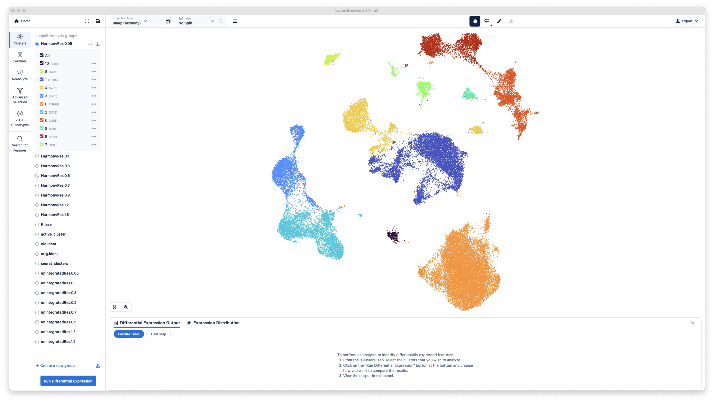
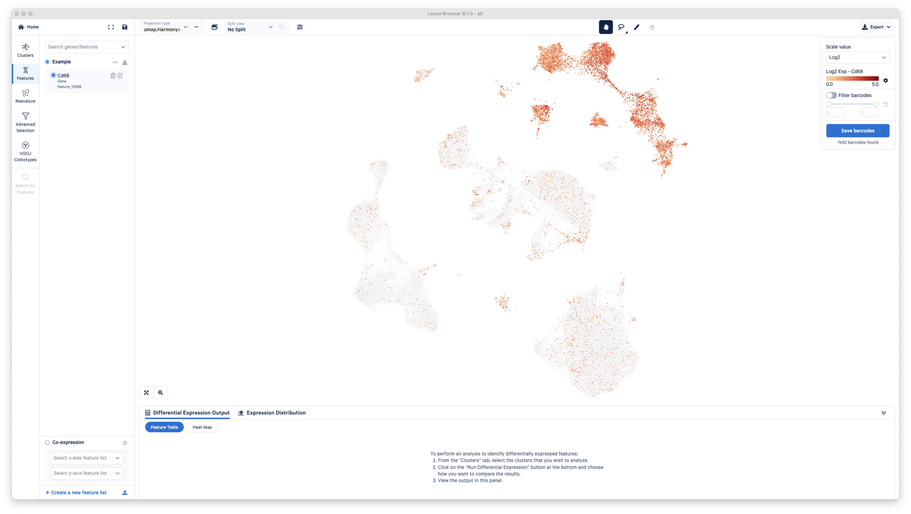
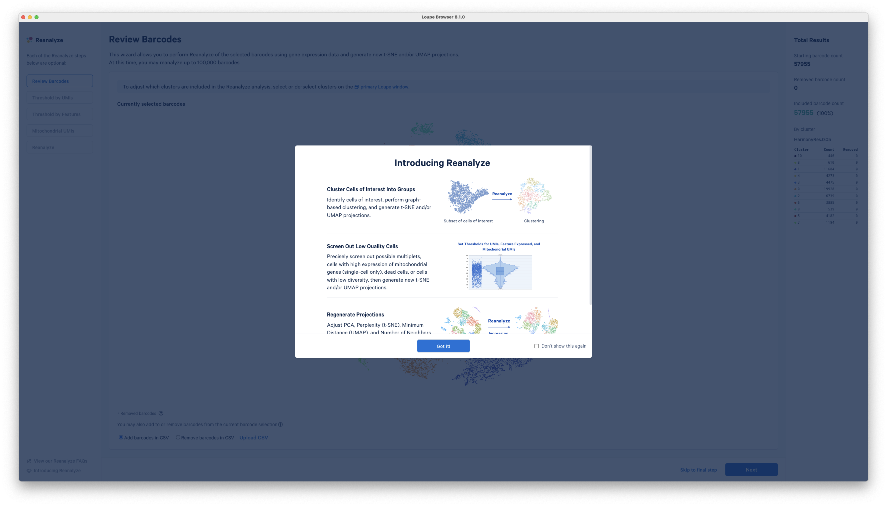

# Loupe Browser

{align=left loading=lazy}

## 10x Genomics single cell visualization software

The Loupe Browser is a powerful tool that allows users to investigate their data without the requirement to write code. It provides an intuitive interface for exploring complex single-cell RNA sequencing data. Users can easily visualize gene expression, identify cell types, and perform differential expression analysis. The software supports interactive data exploration, making it accessible for both novice and experienced researchers.

 

## Installation

Follow these instructions to download the Loupe Browser:

1. Navigate to the [Loupe Browser Download Page](https://www.10xgenomics.com/support/software/loupe-browser/downloads)
2. Select the installation for your computer's opperating system. 
3. Follow any subsequent steps prompted from the installation. 

## Supplemental Files
[Spleen Marker File](supplementalFiles/SpleenMarkersFinal.csv)

[T Cell Subtype Marker File](supplementalFiles/TCellSubTypes.csv)

[Paper Supplemental File](https://pmc.ncbi.nlm.nih.gov/articles/instance/6886498/bin/supp_gr.253880.119_Supplemental_Material_.pdf)

## Preview

#### Homepage

#### Clusters View

#### Features View

#### Reanalyze View

#### Advanced Selection View
